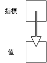

*****************************
所有權
*****************************

**所有權 (ownership)** 是 Rust 的核心概念之一，在許多主流語言中沒有強調所有權的觀念，\
而 Rust 從一開始就放入這個概念，Rust 的安全性和所有權的概念息息相關，但是，這也是 Rust \
難以上手的原因。雖然 Rust 官方文件沒有強調\ **參考 (reference)**\ 的概念，不過，了解參考，\
對於了解所有權有相當的幫助。

*註：Rust 的參考類似 C/C++ 的指標。*

==============
指標與參考
==============

**指標 (pointer)** 本身的值不是資料，而是指向另一個資料的記憶體位置。如下圖：

由於指標本身是整數，透過傳遞指標，不需要拷貝整個原始資料，若資料量較大時，傳遞指標可使得\
程式更有效率。

不同語言對指標的處理方式大異其趣，C 或 C++ 給使用者很大的自由，讓使用者自行操作指標，\
而許多高階語言將指標隱藏起來，使用者完全不會碰觸到指標。Rust 則介於兩者之間，雖然平常\
不需要指標，需要時，Rust 讓使用者有操作指標的自由。

以下是一個 C 語言的例子：

.. code-block:: c

   #include <stdio.h>

   int main(void) {
       int n = 5;

       // Get the address of n
       int* n_ptr = &n;

       // Dereference n_ptr to get n
       printf("%d\n", *n_ptr);

       return 0;
   }

以 Rust 撰寫類似的代碼：

.. code-block:: rust

   fn main() {
       let n = 5;

       // Get the reference of n
       let n_ref = &n;  // & i32

       // Dereference n_ref to get n
       println!("{}", *n_ref);
   }

在本程式中，``n_ref`` 的型別是 ``& i32``，意思是「指向 ``i32`` 型別的\
**參考 (reference)**\ 」，但其觀念上相當接近指標。

以下是另一個 C++ 中使用指標的例子：

.. code-block:: c++

   #include <vector>
   #include <iostream>

   using std::vector;
   using std::cout;
   using std::endl;

   int main() {
       vector<int> vec {1, 2, 3};

       // Modify vec in-place!
       for (auto ptr = vec.begin(); ptr != vec.end(); ptr++) {
           *ptr = (*ptr) * (*ptr);
       }

       // Print out the data of vec in console
       for (auto ptr = vec.begin(); ptr != vec.end(); ptr++) {
           cout << *ptr << " ";
       }
       cout << endl;

       return 0;
   }

在本程式中，我們取得 ``vec`` 的元素的指標，解址取得其值，處理後再存回該元素中。以上例子\
改寫成類似的 Rust 程式碼如下：

.. code-block:: rust

   fn main() {
       let mut vec = vec![1, 2, 3];

       // Modify vec in-place!
       for item in vec.iter_mut() {
           *item = (*item) * (*item);
       }

       // Print out the data of vec in console
       println!("{:?}", vec);
   }

同樣地，我們得到該 vector 的參考，解參考取得其值，處理後再存回該元素中。

接下來，我們開始探討 Rust 的所有權。

==================
所有權
==================

C 和 C++ 給使用者較大的自由，但對某些指標使用造成的問題，沒有特定的規範。我們來看一個 \
C 語言的\ **迷途指標 (dangling pointer)** 的例子：

.. code-block:: c

   #include <stdio.h>
   #include <stdlib.h>

   int main() {
       const int SIZE = 10;

       // Allocate memory for the array a.
       int* a = (int*) malloc(SIZE * sizeof(int));

       // Set the value in a
       for (int i = 0; i < SIZE; i++) {
           int j = i + 1;
           a[i] = j * j;
       }

       // Share the address of a to a1
       int* a1 = a;

       // Oh, the memory of a is freed!
       free(a);
       a = NULL;

       /* Now a1 becomes dangling pointer.
          Accessing data via a dangling pointer is
          an undefined behavior. */
       printf("%d\n", a1[3]);

       return 0;
   }

簡單地說，``a`` 和 ``a1`` 指向同一塊記憶體區塊，在釋放 ``a`` 的記憶體後，``a1`` 變成\
迷途指標 (dangling pointer)。在 C 或 C++ 中，沒有規範如何處理這樣的行為，而 Rust 以 \
**所有權 (ownership)** 來處理這個問題。見以下程式碼：

.. code-block:: rust

   fn main() {
       let v = vec![1, 2, 3];

       // Vector moved from v to v1
       let v1 = v;

       // Error when accessing v
       println!("{}", v[1]);
   }

這個程式引發了以下錯誤：

.. code-block:: console

   error[E0382]: use of moved value: `v`

以及以下附註：

.. code-block:: console

   note: move occurs because `v` has type `std::vec::Vec<i32>`, which does not implement the `Copy` trait

在本程式中，為了避免 ``v`` 和 ``v1`` 存取同一塊記憶體後，因釋放記憶體而造成迷途指標的\
問題，Rust 將 ``v`` 的所有權轉移到 ``v1``，來避免這個問題發生。然而，以下的程式卻可\
正常運行：

.. code-block:: rust

   fn main() {
       let x = 3;

       // Copy x into x1
       let x1 = x;

       // No error when accessing x
       println!("{}", x);
   }

這是因為 Rust 將 ``x`` 的值拷貝一份到 ``x1``，故不會有前述問題發生。

在使用函式時，也會發生同樣的狀況。見以下程式：

.. code-block:: rust

   fn main() {
       let v = vec![1, 2, 3];

       // v is moved into do_nothing
       do_nothing(v);

       // Error when accessing v
       println!("{}", v[1]);
   }

   fn do_nothing(v: Vec<i32>) {
       // Do nothing here.
   }

以下程式，同樣引發以下錯誤：

.. code-block:: console

   error[E0382]: use of moved value: `v`

在本程式中，即使我們對 ``v`` 沒有進行任何實質的操作，仍然發生了所有權轉移的問題。為了\
處理上述問題，Rust 引入 borrowing 的機制，也就是我們下文要討論的內容。

======================
Borrowing
======================

承接上節的內容，我們來看一個 borrowing 的例子：

.. code-block:: rust

   fn main() {
       let v = vec![1, 2, 3];

       // Borrow v to sum
       let s = sum(& v);

       println!("{}", s);

       // v is still accessible
       println!("{}", v[1]);
   }

   fn sum(v: &Vec<i32>) -> i32 {
       let mut sum = 0;

       for e in v.iter() {
           sum += *e;
       }

       sum
   }

在本程式中，Rust 將 ``v`` 的所有權暫時借給 ``sum`` 之中，待函式運行結束後，再將所有權\
轉回 ``v``，使得所有權的機制可正常運行。在其他語言中，也有類似的概念，像是 C++ 的\
參考 (reference)。將以上程式以 C++ 重新改寫如下：

.. code-block:: c++

   #include <vector>
   #include <iostream>

   using std::vector;
   using std::cout;
   using std::endl;

   int sum(vector<int> &);

   int main() {
       vector<int> vec {1, 2, 3};

       // Pass the reference of vec into sum
       int s = sum(vec);

       cout << s << endl;
       cout << vec[1] << endl;
       return 0;
   }

   int sum(vector<int> &vec) {
       int sum = 0;

       for (auto ptr = vec.begin(); ptr != vec.end(); ptr++) {
           sum += *ptr;
       }

       return sum;
   }

在本程式中，我們沒有拷貝整個 ``vec``，而是將其位址傳入 ``sum``。不過，在 C++ 程式中，\
並沒有強調所有權的概念。

*註：C++ 的參考和 Rust 的參考是不同的概念。*

結合我們先前談的可變性的概念，如果我們要在轉移參數所有權後修改其值，必需要明確地指定\
可變性。例如，以下的程式會引發錯誤：

.. code-block:: rust

   fn main() {
       let mut v = vec![1, 2, 3];

       // Try to modify vec in-place
       square_each(& v);

       println!("{}", v[1]);
   }

   fn square_each(v: & Vec<i32>) {
       for e in v.iter_mut() {
           *e = (*e) * (*e);
       }
   }

本程式造成以下的錯誤：

.. code-block:: console

   error: cannot borrow immutable borrowed content `*v` as mutable

若將程式進行適當的修改，則可正確執行。範例如下：

.. code-block:: rust

   fn main() {
       let mut v = vec![1, 2, 3];

       // Modify vec in-place!
       square_each(&mut v);

       println!("{}", v[1]);
   }

   fn square_each(v: &mut Vec<i32>) {
       for e in v.iter_mut() {
           *e = (*e) * (*e);
       }
   }

雖然以上程式可正確執行，但卻不是一個良好的模式，因為這個程式對 ``vec`` 造成了\
**副作用 (side effect)**\ ，也就是說，這個程式會更動 ``vec`` 的狀態。當然，並不是\
絕對不能用這樣的方式寫程式，只是，要思考一下，這樣子的效果是否是自己想要的。

=====================
Lifetime
=====================

-----------------------------------------
Lifetime 所要處理的問題
-----------------------------------------

假設以下的情形：

1. A 取得資源
2. A 將資源的所有權借給 B
3. A 將資源釋放掉
4. B 欲取得資源，造成程式錯誤

而 Rust 透過 lifetime 避免以上問題。如以下範例：

.. code-block:: rust

   fn main() {
       let x;

       {
           let n = 5;

           // Borrow n to y
           let y = &n;

           // Transfer the ownership from y to x
           x = y;
        } // n lives until here

        // n is no longer available.
        println!("{}", x);
   }

本程式造成以下錯誤：

.. code-block:: console

   error: `n` does not live long enough

在本程式中，``y`` 向 ``n`` 借得所有權後，將其轉給 ``x``。但在該區塊結束後，``n`` 的 \
lifetime 已經結束，實質上已經無法取得 ``n``，而 Rust 偵測到這個問題並在編譯程式時引發\
相關的錯誤。然而，在 C 或 C++，卻沒有規範上述行為，見以下範例：

.. code-block:: c++

   #include <iostream>

   using std::cout;
   using std::endl;

   int main() {
       int *x;

       {
           // n become alive here
           int n = 5;

           // Get the address of n
           int* y = &n;

           // Share the address of n to x
           x = y;
       } // n lives until here

       // Now, assess n, which is no longer alive
       // The behavior is undefined.
       cout << *x << endl;

       return 0;
   }

筆者實測，此程式印出 0，但不同電腦上，可能結果不同，而程式設計者不應依賴其結果。由此例\
可見 Rust 和 C 或 C++ 在設計上的相異點。

-----------------------------------
指明 lifetime
-----------------------------------

其實在撰寫函式時，也隱藏著 lifetime 的概念。像是以下的函式

.. code-block:: rust

   fn foo(x: & i32) {
       // Do something
   }

若明確指明 lifetime 則變成

.. code-block:: rust

   fn foo<'a>(x: &'a i32) {
       // Do something
   }

若參數是可變的，則變成

.. code-block:: rust

   fn foo<'a>(x: &'a mut i32) {
       // Do something
   }

其中的 ``'a`` 是一個代稱，代表的是 ``foo`` 函式的 lifetime，而 ``'a`` 不是固定的，\
可以換成其他的字。由於我們到目前為止，都沒有明確寫出 lifetime，讀者可能會感到困惑，這是\
由於 Rust 自動推斷 lifetime 的功能 (lifetime elision)，藉此減少使用者輸入。

如果 struct 內的屬性有參考，也要明確指明 lifetime，如下：

.. code-block:: rust

   struct Foo<'a> {
      x: &'a i32,
   }

-----------------------
static
-----------------------

static 是一個特別的 lifetime 修飾，表示該變數的 lifetime 為整個程式。如下：

.. code-block:: rust

   fn main() {
      let x: &'static str = "Hello, World";
   }

也可用在常數，如下：

.. code-block:: rust

   static FOO: i32 = 5;

   fn main() {
      let x: &'static i32 = &FOO;
   }
