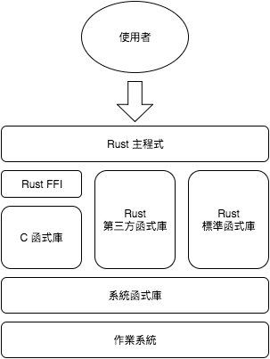
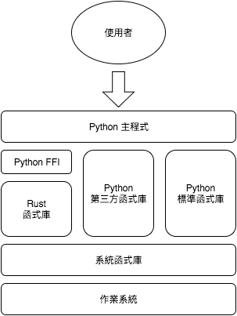

****************************
異種語言合作
****************************

在實務上，程式專案很少會只用同一種語言，而會混用多種語言。像是 \
`Tensorflow <https://www.tensorflow.org/>`_ 這套深度學習 (deep learning) 函式庫的\
核心功能是用 C++ 寫成，提供 C++ 和 Python 的 **binding** 給使用者，但其實官方還另外製作了 \
Java 和 Go 的 binding (目前為 unstable 狀態)，此外，網路上還可以找到其他第三方的 \
binding，像是給 R、Ruby、Rust 等語言使用的 binding 等 。透過這種模式，同一套核心演算法\
可供數個語言使用，不僅節約重覆開發的時間，還可以在效率及易用性間取得平衡。Python 或 Ruby 等\
高階語言易於使用，但效能不佳，C 或 C++ 效能卓越，但開發時間長，透過這種開發模式，不同語言間可\
互取其優點。

雖然本書的主題是 Rust 程式設計，不代表所有的任務都要用 Rust 完成。C 和 C++ 累積多年的\
社群資源，已經相當成熟穩健，全部重新用 Rust 實作不是明智的選擇；Rust 可以呼叫 C 函式庫，\
藉此利用 C 或 C++ 的龐大資源，補足 Rust 現有資源不足處。雖然 Rust 有某些類似高階語言的\
特性，使用 Python 等高階語言實作程式，仍然會比 Rust 來得簡單；這時候，Rust 的角色類似\
於 C 或 C++，可以在關鍵步驟為程式加速。

不同語言能相互使用的原因在於大部分的高階語言都有提供 C API，而程式設計者可以用 Rust \
(或 C/C++/Ada 等) 實作核心功能，輸出成 C 函式庫，然後，再將兩者橋接再一起即可。從前，\
這是一個相當繁瑣的過程，因為不同高階語言的 C API 不同，程式設計者得學習不同的 API。\
所幸，許多高階語言發展出 **FFI (Foreign Function Interface)** 的機制，使得這項工作\
變得簡單許多。

本章分為兩個部分，分別是從 Rust 呼叫 C 和從其他語言呼叫 Rust。

======================
從 Rust 呼叫 C
======================

Rust 本身提供一套簡易的 FFI 以利使用者將 Rust 和 C 結合。Rust 和 C 的結合方式如下假想圖：

Rust 和 C 之間傳遞方式如下：

- 在 C 函數的介面中，數字可直接傳遞，像是 ``i32`` 對應 ``int``，``f64`` 對應 \
  ``double``，C 風格字串無法直接在 Rust 中使用，同樣地，Rust 字串也不能直接輸出成 \
  C 風格字串。Rust 提供函式來進行兩者的轉換
- Rust 中可宣告 C 風格 enum 或 struct ，但欄位需和原 C 函式庫一致
- 對於 C 風格 ``struct`` 若不需要存取其中欄位，可用空的 Rust enum 作為其型別，類似 \
  ``void *`` 的作用
- 由於 C 的 macro 是在預處理 C 程式碼時進行代換，無法輸出到 Rust，需依其規則重新撰寫\
  相對應的 Rust 程式碼
- 引入的 C 函式若有動態配置記憶體，需明確宣告相對應的釋放記憶體的函式，並在 Rust 中呼叫，\
  否則會造成\ **記憶體洩漏 (memory leak)**

Rust 無法直接使用 C++ 函式庫，要先寫 C wrapper 函式，再以 Rust 做 binding。

在 Rust 中宣告 C 風格 ``struct`` 形式如下：

.. code-block:: rust

   #[repr(C)]
   struct CStruct {
       // Declare fields here
   }

同樣地，宣告 C 風格 ``enum`` 形式如下：

.. code-block:: rust

   #[repr(C)]
   enum CEnum {
       // Declare fields here
   }

引入 C 函式的形式如下：

.. code-block:: rust

   // Replace ... with a real C library name
   #[link(name = "...")]
   extern {
       // Declare C functions here
   }

接下來，說明如何在 Rust 中宣告 C 函式。假設以下 C 函式宣告：

.. code-block:: C

   double calculate_something(double x, double y);

轉換成 Rust 函式宣告如下：

.. code-block:: rust

   fn calculate_something(x: f64, y: f64) -> f64;

以下 C 函式宣告有用到複合型別：

.. code-block:: C

   void* something_new(size_t x, size_t y);

假若在 Rust 中有明確宣告該 C 風格 ``struct``，則轉為以下宣告：

.. code-block:: rust

   fn something_new(x: usize, y: usize) -> *mut Struct;

反之，若我們不需要存取該函式中用到的物件，可用一個 empty enum 代表該型別。若只有宣告 \
enum，則轉為以下宣告：

.. code-block:: rust

   fn something_new(x: usize, y: usize) -> Enum;

假設某個 C 風格物件導向的函式如下：

.. code-block:: C

   double operate_something(void* a, void* b);

在 Rust 中宣告如下：

.. code-block:: rust

   fn operate_something(a: *const Struct, b: *const Struct)-> double;

要使用 ``*const Struct`` 或是 ``*mut Struct`` 要視原本的 C 函式中是否有修改該物件\
而定。

在編譯有用到 C 函式庫的 Cargo 專案時，若需要設定額外的編譯參數，可在該 Cargo 專案的\
根目錄建立 *.cargo/config* 設定檔，並在其中加入相關參數。範例如下 \
(摘自 Crates 官網文件)：

.. code-block:: text

   [target.x86_64-unknown-linux-gnu.foo]
   rustc-link-search = ["/path/to/foo"]
   rustc-link-lib = ["foo"]
   root = "/path/to/foo"
   key = "value"

其他更詳細的設定，請看 Crates 相關文件，包括 \
`Config <http://doc.crates.io/config.html>`_ 及 \
`Build Script <http://doc.crates.io/build-script.html>`_\ 。

接下來，我們以 GSL (GNU Scientific Library) 為實例，說明如何從 Rust 呼叫 C 函式庫。\
GSL 是由 GNU 計畫的其中一個項目，提供數學和科學運算的功能，GSL 本身以 C 寫成，以 \
GPL (GNU General Public License) 授權發行。在本例中，為了簡化範例，我們只使用\
一小部分的矩陣 (matrix) 函式。

首先，系統上要預先裝好 GSL，這部分請讀者自行完成。

宣告本範例會用到的型別，包括 *gsl_matrix* (struct)、*gsl_block* (struct) 和 \
*CBLAS_TRANSPOSE* (enum)，有關這三個型別實際的宣告，請自行參考相關的標頭檔。

.. code-block:: rust

   // Declare CBLAS_TRANSPOSE
   #[repr(C)]
   enum CBLAS_TRANSPOSE {
       CblasNoTrans=111,
       CblasTrans=112,
       CblasConjTrans=113
   }

   // Declare gsl_block
   #[repr(C)]
   struct CBlock {
       size: usize,
       data: *mut f64,
   }

   // Declare gsl_matrix
   #[repr(C)]
   struct CMatrix {
       size1: usize,
       size2: usize,
       tda: usize,
       data: *mut f64,
       block: *mut CBlock,
       owner: i32,
   }

宣告本範例中會用到的函式，同樣地，請參考相關的標頭檔。

.. code-block:: rust

   #[link(name = "gsl")]
   extern {
       fn gsl_matrix_calloc(row: usize, col: usize) -> *mut CMatrix;
       fn gsl_matrix_free(m: *mut CMatrix);
       fn gsl_matrix_get(m: *const CMatrix, i: usize, j: usize) -> f64;
       fn gsl_matrix_set(m: *mut CMatrix, i: usize, j: usize, x: f64);
       fn gsl_blas_dgemm(TransA: CBLAS_TRANSPOSE, TransB: CBLAS_TRANSPOSE,
                         alpha: f64, A: *const CMatrix, B: *const CMatrix,
                         beta: f64, C: *mut CMatrix);
   }

在實務上，不建議直接將 C 風格函式直接給外界使用，而會包裝成 Rust 類別，用更合乎 Rust 的\
習慣用法來呼叫。建立一個 Matrix 類別：

.. code-block:: rust

   pub struct Matrix {
       m: *mut CMatrix,
   }

我們這個類別相當簡單，基本上，只是為了隱藏內部的 C 風格 struct。

實作該類別的建構子和解構子：

.. code-block:: rust

   // Constructor
   impl Matrix {
       pub fn new(row: usize, col: usize) -> Matrix {
           let m = unsafe { gsl_matrix_calloc(row, col) };
           Matrix{ m: m }
       }
   }

   // Destructor
   impl Drop for Matrix {
      fn drop(&mut self) {
          unsafe { gsl_matrix_free((*self).m); };
      }
   }

有關 C 函式的呼叫，要在 ``unsafe`` 區塊中完成，這是 Rust 在安全上的考量。在本例中，需要\
實作解構子，因為有用到 C 函式動態建立記憶體區塊。

接著，可以開始建立本類別的公開方法，如下例：

.. code-block:: rust

   impl Matrix {
       pub fn get(&self, i: usize, j: usize) -> f64 {
           unsafe { gsl_matrix_get((*self).m, i, j) }
       }
   }

我們也可以視需求，更改本類別的公開方法。在原先的 GSL 中，矩陣相乘的介面較複雜，我們自行\
簡化其介面，範例如下：

.. code-block:: rust

   impl Matrix {
       pub fn dot(a: & Matrix, b: & Matrix) -> Matrix {
           let c = Matrix::new(a.row(), b.col());
           unsafe {
               gsl_blas_dgemm(
                   CBLAS_TRANSPOSE::CblasNoTrans,
                   CBLAS_TRANSPOSE::CblasNoTrans,
                   1.0, a.m, b.m, 0.0, c.m
               )
           }
           c
       }
   }

   impl Matrix {
       fn row(& self) -> usize {
           unsafe { (*(*self).m).size1 }
       }
   }

   impl Matrix {
       fn col(& self) -> usize {
           unsafe { (*(*self).m).size2 }
       }
   }

在這裡，我們額外建立了兩個原先在 GSL 中沒有的私有方法，這樣就不需要將存取其型別的步驟寫在\
方法中，可略為簡化程式，日後也可以重覆利用。

由於 GSL 不是標準函式庫，編譯時需給予額外參數。可參考筆者在 Linux 下編譯時所用設定：

.. code-block:: text

   [target.x86_64-unknown-linux-gnu]
   rustflags = ["-lgsl", "-lgslcblas"]

如果我們繼續發展這個範例，甚至可以建立整個 GSL 在 Rust 下的 binding，但我們只是\
展示如何從 Rust 呼叫 C，我們的範例就在此打住。筆者實作了兩個小型範例，一個呼叫 GSL 的\
複數 (`連結 <https://github.com/cwchentw/gsl_complex_demo_in_Rust>`_)，\
一個呼叫 GSL 的矩陣 \
(`連結 <https://github.com/cwchentw/gsl_matrix_demo_in_Rust>`_)，
有需要的讀者可自行前往參考。

==========================
從其他語言呼叫 Rust
==========================

Rust 函式庫可以輸出成 C (動態/靜態) 函式庫，輸出的 C 函式庫可再給其他高階語言使用，這時候 \
Rust 的角色很像 C++ 或 Ada，替代 C 為高階語言提供核心功能。以 Python 為例，其關係如下：

Rust 輸出 C 函式庫的方式如下：

- 若要輸出常數，Rust 數字可直接輸出成對應位數的 C 數字，但字串則無法直接輸出為常數
- struct 和 enum 宣告無法輸出，需自行於 C 標頭檔另行宣告，或由第三方工具產生
- Rust 函式可輸出為 C 函式。在函式的介面，數字可直接對應；字串需轉換為 C 風格字串；對於\
  複合型別建議在 C 中轉為\ **不透明指標 (opaque pointer)**\ ，用 ``void *`` 傳遞
- 由於 C 沒有直接支援物件導向，需將 Rust 物件轉為符合 C 風格的物件導向語法
- 若有動態配置記憶體的函式，需搭配釋放記憶體的函式，並於其他語言中呼叫，否則會造成記憶體洩漏

Rust 不會自動生成 C 語言標頭檔，需由使用者自行撰寫，或是透過 \
`rusty-cheddar <https://github.com/Sean1708/rusty-cheddar>`_ 這個工具產生，\
若有需要的讀者可自行參考。

這裡會介紹三個範例，第一個範例僅輸出常數，第二個範例由純函式組成，最後一個範例則有物件導向的\
語法。

---------------------------
從 Rust 輸出常數
---------------------------

首先，以 Rust 實作如下：

.. code-block:: rust

   #[no_mangle]
   pub static VAR: i32 = 42;

要修改 *Cargo.toml*，增加以下內容：

.. code-block:: text

   [lib]
   name = "const"
   crate_type = ["dylib"]

在本例中，我們的目標是編譯動態函式庫，若要編譯靜態函式庫，改為 ``staticlib`` 即可。

接著，編譯此專案：

.. code-block:: console

   $ cargo build --release

從 C 呼叫如下：

.. code-block:: C

   #include <stdio.h>

   extern const int VAR;

   int main() {
       int x = VAR;
       printf("%d\n", x);
   }

以 GCC 編譯後呼叫此程式：

.. code-block:: console

   $ gcc -o const main.c -Ltarget/release -lconst

   # Set LD_LIBRARY_PATH, or the program cannot run on Linux
   $ LD_LIBRARY_PATH=target/release ./const
   42

完整的範例程式碼可看\ `這裡 <https://github.com/cwchentw/libconst-rust-demo>`_\ ，\
該專案內另附有從 Python 及 Ruby 透過各自的 FFI 呼叫的範例，但 Python 的 FFI 尚未實作\
從動態函式庫呼叫常數的功能，故僅供參考。

---------------------------
從 Rust 輸出函式
---------------------------

我們先看一下這個範例所産生的介面：

.. code-block:: C

   #ifndef __DOUBLER_H__
   #define __DOUBLER_H__

   #ifdef __cplusplus
   extern "C" {
   #endif

     int double_int(int);
     double double_float(double);
     char* double_str(char*);
     void str_free(char*);

   #ifdef __cplusplus
   }
   #endif

   #endif  // __DOUBLER_H__

從 C 呼叫的範例如下：

.. code-block:: C

   #include <stdio.h>
   #include "doubler.h"

   int main() {
       printf("%d\n", double_int(2));
       printf("%lf\n", double_float(1.3));
       char* str = double_str("Hi");
       printf("%s\n", str);
       str_free(str);

       return 0;
   }

這個範例相當地簡單，將放入的資料放大兩倍後回傳。由於我們有配置記憶體給字串，故需另外撰寫\
函式來釋放記憶體。雖然在實務上，較少會用 C 呼叫 Rust 所寫的函式，但使用 C 可以在沒有額外\
介面下檢查函式是否有錯，或檢查記憶體洩漏等。

接著，展示如何在 Rust 中實作本函式庫：

.. code-block:: rust

   use std::ffi::{CStr, CString};
   use std::os::raw::c_char;

   #[no_mangle]
   pub extern "C" fn double_int(x: i32) -> i32 {
       x * 2
   }

   #[no_mangle]
   pub extern "C" fn double_float(x: f64) -> f64 {
       x * 2.0
   }

   #[no_mangle]
   pub extern "C" fn double_str(x: *const c_char) -> *const c_char {
       let string = unsafe { CStr::from_ptr(x).to_str().unwrap() };
       let output = format!("{}{}", string, string);
       CString::new(output).unwrap().into_raw()
   }

   #[no_mangle]
   pub extern "C" fn str_free(x: *mut c_char) {
       if x.is_null() {
           return
       }

       unsafe { Box::from_raw(x); }
   }

若函式要輸出為 C 函式，要以 ``extern "C"`` 告訴 Rust 該函式要輸出至 C，並以 \
``#[no_mangle]`` 避免 Rust 在編譯時修改函式名稱。注意在字串相關的函式中，內部會將 \
C 字串轉為 Rust 字串，但處理完後要再轉回 C 字串再輸出，另外，字串非基本型別，要回到 \
Rust 中釋放記憶體。

接著，我們以 Python 為例，展示如何在高階語言中呼叫此函式庫：

.. code-block:: python

   from cffi import FFI
   import six

   ffi = FFI()

   # Define the interface of the C library
   ffi.cdef("""
   int double_int(int);
   double double_float(double);
   char* double_str(char*);
   void str_free(char*);
   """)

   # You may judge the underlying platform
   # and load different library file.
   libdoubler = ffi.dlopen('target/release/libdoubler.so')

   # A simple wrapper for the C library
   class Doubler:
       @classmethod
       def int(cls, x):
           return libdoubler.double_int(x)

       @classmethod
       def float(cls, x):
           return libdoubler.double_float(x)

       @classmethod
       def _str(cls, x):
           # Bind C string to Python varible
           cstring = libdoubler.double_str(bytes(x, 'utf8'))

           # Decode C string into Python string
           yield ffi.string(cstring).decode('utf8')

           # Free the memory in Rust
           libdoubler.str_free(cstring)

       @classmethod
       def str(cls, x):
           return six.next(cls._str(x))

   if __name__ == '__main__':
       print(Doubler.int(2))
       print(Doubler.float(1.3))
       print(Doubler.str('Hi'))

cffi 是 Python 對 C 的 FFI，可以用很簡單的方式橋接外部函式庫，這裡我們不說明 cffi \
詳細的使用方式，請讀者自行參考相關線上資訊。不建議直接暴露 C 風格的介面給使用者，會\
進行簡單的包裝，讓介面更符合 Python 的慣性用法。此外，在我們包裝 C 函式時，隱藏釋放\
記憶體的動作，使用起來更為自然。

若要觀在完整的範例，可到\
`這裡 <https://github.com/cwchentw/libdoubler-rust-demo>`_\ ，除了 Rust 程式碼，\
還有從 Python 和 Ruby 呼叫本函式庫的範例。此外，\
`這裡 <https://github.com/cwchentw/doubler-php-extension-demo>`_\ 還有以 \
PHP-CPP 建立可呼叫本函式庫的 PHP extension 範例。PHP-CPP 是一套用 C++ 撰寫 \
PHP extension 的函式庫，這裡不詳細說明，有興趣的讀者可自行搜尋相關資源。

---------------------------
從 Rust 輸出物件
---------------------------

同樣地，我們先看此範例的介面：

.. code-block:: C

   #ifndef __MATRIX_H__
   #define __MATRIX_H__

   #ifdef __cplusplus
   extern "C" {
   #endif

     void* matrix_new(size_t, size_t);
     double matrix_get(void*, size_t, size_t);
     void matrix_set(void*, size_t, size_t, double);
     void matrix_free(void*);

   #ifdef __cplusplus
   }
   #endif

   #endif  // __MATRIX_H__

此範例産生較複雜的物件，我們不在 C 當中處理，故以 ``void *`` 傳遞此物件。此處使用到 C \
風格的物件導向，簡單地說，就是將物件作為第一個參數傳遞到函式中，由於使用者無法直接處理此\
物件內部的資料，函式實作者需實作必要的公開方法。

接著，我們看一下如何在 C 中使用此函式庫：

.. code-block:: C

   #include <stdio.h>
   #include "matrix.h"

   int main() {
       void* m = matrix_new(3, 3);

       printf("(1, 1) = %lf\n", matrix_get(m, 1, 1));

       matrix_set(m, 1, 1, 99);
       printf("(1, 1) = %lf\n", matrix_get(m, 1, 1));

       matrix_free(m);

       return 0;
   }

在本例中，我們有動態配置記憶體，故需手動釋放。

接著，展示如何以 Rust 實作本函式庫：

.. code-block:: rust

   #[repr(C)]
   pub struct Matrix {
       m: Vec<Vec<f64>>,
   }

   #[no_mangle]
   pub extern "C" fn matrix_new(nrow: usize, ncol: usize) -> *mut Matrix {
       let mut m = Vec::new();
       for _ in 0..(nrow) {
           let mut n = Vec::new();

           for _ in 0..(ncol) {
               n.push(0.0);
           }

           m.push(n);
       }

       Box::into_raw(Box::new(Matrix { m: m }))
   }

   #[no_mangle]
   pub extern "C" fn matrix_get(matrix: *const Matrix, row: usize, col: usize)
                                   -> f64 {
       unsafe {
           (*matrix).m[row][col]
       }
   }

   #[no_mangle]
   pub extern "C" fn matrix_set(matrix: *mut Matrix,
                                row: usize, col: usize, value: f64) {
       unsafe {
           (*matrix).m[row][col] = value;
       }
   }

   #[no_mangle]
   pub extern "C" fn matrix_free(matrix: *mut Matrix) {
       if matrix.is_null() {
           return
       }

       unsafe { Box::from_raw(matrix); }
   }

在本例中，我們輸出一個複雜的物件，程式撰寫者不需要知道在 C 中如何宣告此物件的型別，使用\
不透明指標處理即可。除了基本型別外，都要撰寫釋放記憶體的函式，因為在 C 中無法直接處理，\
需回到 Rust 中釋放記憶體。

同樣地，我們以 Python 為例，展示如何從高階語言中呼叫此函式庫：

.. code-block:: python

   from cffi import FFI

   ffi = FFI()

   # Define the interface of the C library
   ffi.cdef("""
   void* matrix_new(size_t, size_t);
   double matrix_get(void*, size_t, size_t);
   void matrix_set(void*, size_t, size_t, double);
   void matrix_free(void*);
   """)

   # Load the dynamic library
   libmatrix = ffi.dlopen('target/release/libmatrix.so')

   # A simple wrapper for the C library
   class Matrix:
       def __init__(self, row, col):
           self.m = libmatrix.matrix_new(row, col)

       def __del__(self):
           libmatrix.matrix_free(self.m)

       def get(self, row, col):
           return libmatrix.matrix_get(self.m, row, col)

       def set(self, row, col, value):
           libmatrix.matrix_set(self.m, row, col, value)

   if __name__ == '__main__':
       m = Matrix(3, 3)
       print(m.get(1, 1))
       m.set(1, 1, 99)
       print(m.get(1, 1))

同樣地，我們會包裝此函式庫，而不會直接暴露 C 風格函式給使用者，還可以隱藏釋放記憶體的動作。

如果讀者想觀看完整的專案，可到
`這裡 <https://github.com/cwchentw/libmatrix-rust-demo>`_\ ，除了 Rust 程式碼外，\
還有以 Python 和 Ruby 呼叫此函式庫的範例。此外，\
`這裡 <https://github.com/cwchentw/matrix-php-extension-demo>`_ 有以 PHP-CPP \
撰寫的 PHP extension。

=========================
小結
=========================

由以上數個範例可看出，Rust 確實可以和 C++ 或 Ada 一般，替代 C 為高階語言提供核心功能。\
讀者可再自行查閱製作各個高階語言的延伸模組的相關資訊，就可以開始製作自己的函式庫或\
物件庫了。

通常在製作某個程式的原型 (prototype) 時，不急著以 Rust 實作核心功能，可先以自已選定的\
高階語言，如 Python 或 Ruby 等，實作程式，待評估整體程式效能後，在不修改界面的情形下，\
再重新實作效能瓶頸的部分，以節省開發時間。
