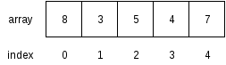
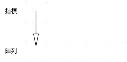
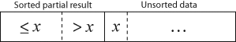

***********************************
陣列、Vector 和 Slice
***********************************

我們從本章開始，會介紹數種\ **容器 (container)**\ ，容器有特定的內部結構，其作用在於裝載\
資料，此外，容器會提供一些方法，讓我們藉由操作容器，存取其中的資料。傳統上，容器相關的內容\
多見於介紹\ **資料結構 (data structure)** 的書籍，有興趣的讀者可自行查閱相關資料。本章\
會介紹陣列 (array)、vector 和 slice。

============
陣列
============

陣列是一種線性的容器，儲存同一種型別的資料，而其長度在生成後即固定下來，陣列中的資料在\
記憶體中是連續而緊密排列的，如下圖：

陣列的好處在於可快速存取陣列中的資料，因為陣列是透過索引值存取資料，但當要改變陣列\
長度時，效率則較差，因為要複製陣列中的資料。

-----------------
建立陣列
-----------------

建立陣列有兩種方式，一種是直接將資料寫在陣列中，如以下範例：

.. code-block:: rust

   fn main() {
       let array = [1, 2, 3, 4, 5];
   }

一種則是以 ``[T; N]`` (T: 型別，N: 長度) 這種方式初始化陣列。範例如下：

.. code-block:: rust

   fn main() {
       const SIZE: usize = 5;

       // [0.0, 0.0, 0.0, 0.0, 0.0]
       let mut array: [f64; SIZE] = [0.0; SIZE];
   }

C/C++ 可用動態配置記憶體産生陣列，在 Rust 中相對應的動作是使用 vector。\
Vector 是一種可動態改變大小的線性容器，我們將於下文介紹。

-----------------------
存取陣列中資料
-----------------------

陣列使用非負整數作為存取資料的索引 (index)，如下例：

.. code-block:: rust

   fn main() {
       let array = [1, 2, 3];

       assert_eq!(array[0], 1);
       assert_eq!(array[1], 2);
       assert_eq!(array[2], 3);
   }

要注意的是，陣列的索引值是從 0 開始，對於程式設計初學者來說，時常會覺得容易搞混。一個簡單的\
想法是將索引值視為\ **偏離值 (offset)**\ ，如下圖：

也可將資料存入陣列，如下例：

.. code-block:: rust

   fn main() {
       let mut array = [0; 3];

       array[0] = 1;
       array[1] = 2;
       array[2] = 3;

       assert_eq!(array[0], 1);
       assert_eq!(array[1], 2);
       assert_eq!(array[2], 3);
   }

---------------
走訪陣列
---------------

使用陣列等資料結構的好處之一，在於可以結合迴圈走訪陣列中的資料。如果我們想走訪陣列中的元素，\
其中一個方法是以陣列的索引值來走訪陣列，如下例：

.. code-block:: rust

   fn main() {
       // Numbers in German
       let array = ["eins", "zwei", "drei", "vier", "fünf"];

       for i in 0..array.len() {
           println!("{}", array[i]);
       }
   }

或是使用迭代器，如下：

.. code-block:: rust

   fn main() {
       let array = ["eins", "zwei", "drei", "vier", "fünf"];

       for element in array.iter() {
           println!("{}", element);
       }
   }

然而，陣列本身不能走訪，所以以下程式碼是錯誤的：

.. code-block:: rust

   fn main() {
       let array = ["eins", "zwei", "drei", "vier", "fünf"];

       // Error
       for element in array {
           println!("{}", element);
       }
   }

會引發以下錯誤訊息：

.. code-block:: console

   error[E0277]: the trait bound `[&str; 5]: std::iter::Iterator` is not satisfied

如果要在走訪陣列時，修改其中的資料，可用索引值走訪陣列，如下：

.. code-block:: rust

   // Call rand package for random number generation
   extern crate rand;

   use rand::Rng;

   fn main() {
       const SIZE: usize = 10;
       let mut array = [0; SIZE];

       for i in 0..array.len() {
           // Set a random number between 1 and 100
           array[i] = rand::thread_rng().gen_range(1, 100 + 1);
       }
   }

如果要使用迭代器，則可修改程式如下：

.. code-block:: rust

   extern crate rand;

   use rand::Rng;

   fn main() {
       const SIZE: usize = 100;
       let mut array = [0; SIZE];

       for e in array.iter_mut() {
           *e = rand::thread_rng().gen_range(1, 100 + 1);
       }
   }

其中的 ``*e`` 用到\ **參考 (reference)** 的概念，簡單地說，參考存的是變數在記憶體中位置，\
我們透過\ **解參考 (dereferencing)** 取得變數本身。我們會於後續章節中介紹參考。

-----------------
陣列的限制
-----------------

目前 Rust 的陣列有一些使用上的限制，某些函式在陣列長度大於 32 時無法使用。像是下列看起來\
正常無誤的程式碼：

.. code-block:: rust

   extern crate rand;

   use rand::Rng;

   fn main() {
       const SIZE: usize = 33;  // Watch out when SIZE > 32
       const MIN: i32 = 1;
       const MAX: i32 = 100;

       let mut array: [i32; SIZE] = [0; SIZE];

       for i in 0..SIZE {
           array[i] = rand::thread_rng().gen_range(MIN, MAX + 1);
       }

       println!("{:?}", array);  // Error when SIZE > 32
   }

卻引發下列錯誤：

.. code-block:: console

   error[E0277]: the trait bound `[i32; 33]: std::fmt::Debug` is not satisfied

這些 trait 的大小限制是 Rust 內部實作的問題，而不是一般程式語言中陣列的正常行為，Rust 官方\
文件也有提到這個議題。在 Rust 改善這點前，我們有幾個處理方式，包括 (1) 自行實作相關 trait \
(2) 避免使用這些方法 (3) 改用 vector。(1) 不是通用的方法，因為針對每個長度，都要重新實作\
一次，但若有需求，仍可考慮；(2) 則會限制了陣列的使用場合；通常可考慮 (3)。

=================
Vector
=================

Vector 是一種可動態改變長度的線性容器，其內部實作也是陣列，但可動態增加長度。由於 vector \
使用方式類似陣列，但較陣列靈活，實際上，vector 使用的場合會比陣列多。

-------------------
建立 vector
-------------------

建立 vector 有兩種方式，一種是以 ``vec!`` 巨集直接建立，一種是先建立空的 vector 後再\
陸續加入資料。

以下程式以 ``vec!`` 巨集建立 vector：

.. code-block:: rust

   fn main() {
       let vec = vec![1, 2, 3];
   }

以下程式先建立 vector 後，再加入資料：

.. code-block:: rust

   fn main {
       /* Type inference works here,
          so we don't explicitly declare
          the type of vec. */
       let mut vec = Vec::new();  // vec<i32>

       // Append data into the tail of the vector
       vec.push(1);
       vec.push(2);
       vec.push(3);
   }

``push`` 的概念是，從 vector 尾端附加一個新的元素，就像是在一列火車尾端掛載一節車箱般。\
Rust 的 vector 從尾端加入資料的效率相當好，可視為常數時間。

*註：以演算法的術語來說，為 amortized O(1)。*

-------------------------------------
存取 vector 中的資料
-------------------------------------

和陣列類似，vector 也是以非負整數做為索引。見以下範例：

.. code-block:: rust

   fn main() {
        let vec = vec![1, 2, 3];

        assert_eq!(vec[0], 1);
        assert_eq!(vec[1], 2);
        assert_eq!(vec[2], 3);
   }

同樣地，也可以存入資料。如下例：

.. code-block:: rust

   fn main() {
       let mut vec = vec![1, 2, 3];

       vec[1] = 99;  // Feed data into vector

       assert_eq!(vec[0], 1);
       assert_eq!(vec[1], 99);
       assert_eq!(vec[2], 3);
   }

-------------------
走訪 vector
-------------------

如果要走訪 vector，可以使用索引，如下例：

.. code-block:: rust

   fn main() {
       let vec = vec![1, 2, 3];

       for i in 0..(vec.len()) {
           println!("{}", i);
       }
   }

或是使用迭代器，如下例：

.. code-block:: rust

   fn main() {
       let vec = vec![1, 2, 3];

       for element in vec.iter() {
           println!("{}", element);
       }
   }

如果需要在走訪 vector 改變其值，可以用索引走訪：

.. code-block:: rust

   fn main() {
       let mut vec = vec![1, 2, 3];

       for i in 0..vec.len() {
           vec[i] = vec[i] * vec[i];
       }

       assert_eq!(vec[0], 1);
       assert_eq!(vec[1], 4);
       assert_eq!(vec[2], 9);
   }

或是使用迭代器：

.. code-block:: rust

   fn main() {
       let mut vec = vec![1, 2, 3];

       for element in vec.iter_mut() {
           *element = (*element) * (*element);
       }

       assert_eq!(vec[0], 1);
       assert_eq!(vec[1], 4);
       assert_eq!(vec[2], 9);
   }

同樣地，這裡用到解參考。

------------------------
操作 vector
------------------------

以下用實例來介紹 vector 的操作：

.. code-block:: rust

   fn main() {
       // Declare an empty vector
       let mut vec = Vec::new();

       // Append data to the tail of the vector
       vec.push(1);
       vec.push(2);
       vec.push(3);

       // Get the length of the vector
       assert_eq!(vec.len(), 3);

       // Pop data from the tail of the vector
       let popped = vec.pop().unwrap();
       assert_eq!(popped, 3);
       assert_eq!(vec, vec![1, 2]);

       // Insert data into the middle of the vector
       vec.insert(1, 99);
       assert_eq!(vec, vec![1, 99, 2]);

       // Remove data from the middle of the vector
       let removed = vec.remove(1);
       assert_eq!(removed, 99);
   }

由本例，可以看到 vector 可動態改變長度，而不需手動進行資料的搬移。然而，vector 內部仍然\
是數列，除了從尾端增加資料外，vector 在增減長度時會牽涉到資料的拷貝，若有大量資料搬移的\
需求，可能要考慮改用其他的容器。

``vec.pop().unwrap()`` 這個部分的程式碼可能會令讀者困惑，這是 Rust 的特殊容器 Option。該容器\
的用途是為了處理錯誤情形，在從 vector 尾端取出資料時，有可能取出的值為空值，故 Rust 將值包裝\
在該容器中。這部分牽涉到 enum 的概念，將於後續章節中說明。

================
Slice
================

Slice 是一種用來檢視陣列或 vector 的元素的型別，其內部包括指向陣列或 vector 的參考和原本的\
陣列或 vector 的長度。由於 slice 使用參考，故不需要拷貝陣列或 vector 的資料。簡單地說，\
參考不存放資料本身，而存放指向資料的記憶體位置，透過參考，可間接取得資料。如下圖：

若讀者對參考覺得陌生，也不用擔心，本書後續的章節會談到參考的概念，可之後再回頭檢視這裡的內容。

------------------
建立 slice
------------------

建立 slice 的方法是先建立陣列或 vector 後，再建立 slice，如下：

.. code-block:: rust

   fn main() {
       /* Internally, it works as this:
          let _slice = [1, 2, 3, 4, 5];
          let slice = &_slice; */
       let slice = &[1, 2, 3, 4, 5];
   }

有 C/C++ 經驗的讀者可能會覺得困惑，為什麼我們可以對值取參考。其實，在內部，Rust 會建立\
一個暫時變數，再將其參考指向程式設計者指定的變數。

--------------------------
存取 slice 中的資料
--------------------------

如同陣列，slice 也可以用索引取出資料，如下：

.. code-block:: rust

   fn main() {
       let slice = &[1, 2, 3];

       assert_eq!(slice[0], 1);
       assert_eq!(slice[1], 2);
       assert_eq!(slice[2], 3);
   }

若設定適當的可變性，slice 也可寫入資料，如下：

.. code-block:: rust

   fn main() {
       let slice = &mut [1, 2, 3];

       // Write data into slice
       slice[1] = 99;

       assert_eq!(slice[0], 1);
       assert_eq!(slice[1], 99);
       assert_eq!(slice[2], 3);
   }

-------------------
走訪 slice
-------------------

Slice 的其中一個作用，在於可自動轉為迭代器，範例如下：

.. code-block:: rust

   fn main() {
       let array = ["eins", "zwei", "drei", "vier", "fünf"];

       // It works when the array size <= 32
       for element in &array {
          println!("{}", element);
       }
   }

如果 slice 是由陣列而來，而原陣列元素個數在超過 32 個時，此方法不能使用，見前文說明。經筆者\
測試，若 slice 是由 vector 而來，則沒有上述限制。

設定好可變性後，也可以在走訪 slice 時改變其值，範例如下：

.. code-block:: rust

   extern crate rand;

   use rand::Rng;

   fn main() {
       const SIZE: usize = 10;
       let mut array = [0; SIZE];

       for element in &mut array {
           *element = rand::thread_rng().gen_range(1, 100 + 1);
       }
   }

同樣的，若 slice 是由陣列而來，同樣會受到長度限制的問題。

==================================
(案例選讀) Insertion Sort
==================================

在本節中我們練習實作 insertion sort。Insertion sort 是一種簡單易懂的排序演算法 \
(sorting algorithm)，對於小型的資料效率佳。實作方式有兩種，一種是額外建立一個串列，再將\
資料依序插入該串列中，一種則是原地修改陣列，本節採用後者。

陣列在排序前如下示意圖 (摘自維基百科)：

而排序後如下圖 (摘自維基百科)：

.. image:: img_array_vector_slice/Insertionsort-after.png
   :alt: Insertion sort 插入後

將 insertion sort 寫成虛擬碼如下：

.. code-block:: text

   Let A a zero-based array with size n

   for i from 1 to n - 1 {
       x = A[i]
       j = i
       while j > 0 and A[j-1] > x {
           A[j] = A[j-1]
           j = j - 1
       }
       A[j] = x
   }

同樣地，我們的範例程式碼用到 rand 套件，需於 *Cargo.toml* 中加入相關內容：

.. code-block:: text

   [dependencies]
   rand = "0.3"

這裡附上範例程式碼，以供參考：

.. code-block:: rust

   // Call rand library
   extern crate rand;

   use rand::Rng;

   fn main() {
       // Initialize variables
       const SIZE: usize = 10;
       let mut array: [i32; SIZE] = [0; SIZE];

       // Set array elements with random integers
       for i in 0..SIZE {
           array[i] = rand::thread_rng().gen_range(1, 100 + 1);
       }

       // Print out unsorted array
       print!("Before sort: ");
       display_slice(&array);

       // Insertion sort.
       // Modify the array in-place.
       for i in 1..(array.len()) {
           let x = array[i];  // Temp data
           let mut j = i;
           while j > 0 &&  array[j-1] > x {
              array[j] = array[j-1];  // Move element one step
              j -= 1;
           }
           array[j] = x;  // Put back temp data
       }

       // Print out sorted array
       print!("After sort: ");
       display_slice(&array);
   }

   // Function to print out array with arbitrary size
   fn display_slice(slice: &[i32]) {
       for i in 0..slice.len() {
           print!("{}", slice[i]);

           if i < slice.len() - 1 {
               print!(", ");
           }
       }
       println!("");
   }

在這裡，我們暫不講解關於函式的部分，而留在後續章節中另行介紹。簡單地說，這個函式不受到陣列\
長度的限制，可在終端機印出 slice 內的資料。對於有 C 程式設計經驗的讀者，會發現該函式接收 \
slice 後可從 slice 得到其長度，在內部，Rust 的 slice 和 C 的陣列不同，帶有長度的資訊。

除了 insertion sort 外，還有一些排序演算法可以用陣列實作，舉例如下：

* Bubble sort
* Selection sort
* Bucket sort

讀者有興趣的話，可自行試著練習看看這些演算法。
