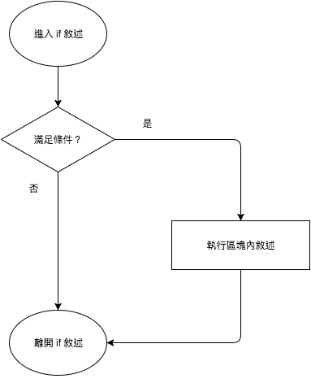
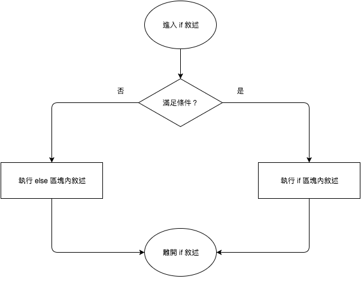
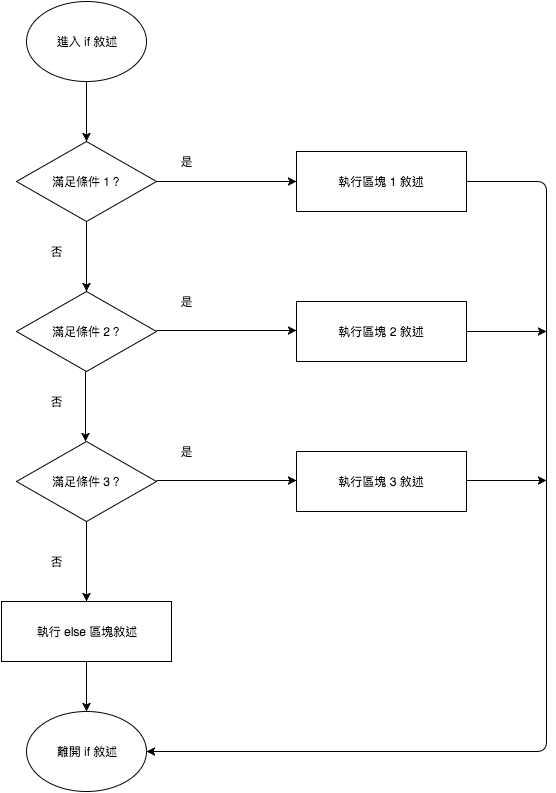
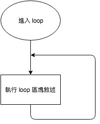
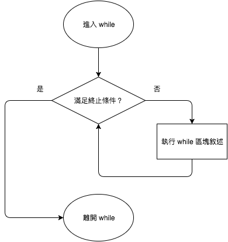
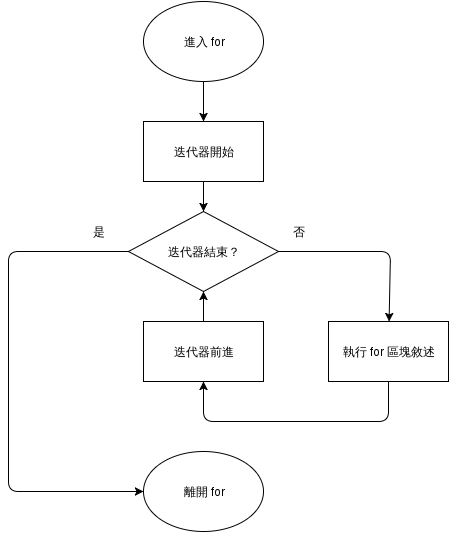
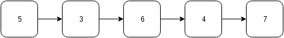

*********************
控制流程
*********************

到目前為止，我們的程式都是由上往下依序執行。透過控制流程，可以藉由改變程式執行的順序\
而達到不同的效果。

控制流程分為兩種：

* 條件控制 (conditional)
* 迴圈 (loop)

我們將在本文中介紹這些控制流程。

==================
條件控制
==================

條件控制的作用在判斷，符合特定條件時，才執行特定區塊內的程式碼，使得程式可以依不同情境\
改變其行為。Rust 的條件控制有 ``if`` 和 ``match``。

--------------
if
--------------

最常用的條件敘述為 ``if``，其想法如以下流程圖：



**虛擬碼 (pseudo code)** 是一種介於文字敘述和程式碼間的程式表達方式，在撰寫程式碼前，\
可先使用虛擬碼整理流程，其好處在於可用抽象的方式表達程式的執行步驟。虛擬碼沒有固定的撰寫方式，\
有些會寫得很像文字，有些會寫得很像數學公式或程式碼。在撰寫虛擬碼時，會先省略程式碼的實作細節，\
專注在抽象思路上。

將 ``if`` 寫成虛擬碼如下：

.. code-block:: text

   if condition {
       statement
   }

以下是一個實例：

.. code-block:: rust

   fn main() {
       let x = 3;

       if x > 0 {
           println!("x is larger than zero");
       }
   }

``if`` 還可以選擇性加入 ``else`` 區塊，其想法如下：



寫成虛擬碼如下：

.. code-block:: text

   if condition {
       statement 1
   } else {
       statement 2
   }

以下是一個實例：

.. code-block:: rust

   fn main() {
       let x = 3;

       if x > 10 {
           println!("x is larger than 10");
       } else {
           println!("x is not larger than 10");
       }
   }

如果有更複雜的條件，可以用 ``if``\ -\ ``else if``\ -``else``\ ，其想法如下：



寫成虛擬碼如下：

.. code-block:: text

   if condition 1 {
       statement 1
   } else if condition 2 {
       statement 2
   } else {
       statement 3
   }

其中 ``else if`` 區塊可視需要重覆多次，而最後的 ``else`` 區塊可省略。

以下是一個實例：

.. code-block:: rust

   fn main() {
       let x = 0;

       if x > 0 {
           println!("x is larger than zero");
       } else if x == 0 {
           println!("x is equal to zero");
       } else {  // x < 0
           println!("x is smaller than zero");
       }
   }

``if`` 也可以作為回傳值，如下例：

.. code-block:: rust

   fn main() {
       let score = 83;

       let grade = if score > 90 {
           "A"
       } else if score > 80 {
           "B"
       } else if score > 70 {
           "C"
       } else if score > 60 {
           "D"
       } else {
           "F"
       };

       assert_eq!(grade, "B");
   }

利用 ``if`` 回傳值時，要注意兩點。首先，回傳值不要加分號 ``;```，第二，``if`` 區塊後\
要加分號。在 Rust 中，沒加分號的程式碼為\ **表達式 (expression)**\ ，而有加分號的程式碼為\
**敘述 (statement)**\ 。在本程式中，``"A"``、``"B"`` ... ``"F"`` 皆為回傳值，視為\
表達式，``if`` 區塊本身也為表達式。除了回傳值以外，程式碼都要寫成敘述，故最後需再\
加上分號。

---------------
match
---------------

對於多個 ``if``\ -\ ``else if``\ -``else``\ ，可以用 ``match`` 簡化。範例如下：

.. code-block:: rust

   fn main() {
       let grade = "A";

       match grade {
           "A" => println!("Wonderful"),
           "B" => println!("Good"),
           "C" => println!("So so"),
           "D" => println!("It could be better"),
           "F" => println!("Oh, oh"),
           _ => println!("Unknown grade"),  // Error on removal.
       }
   }

雖然 Rust 的 ``match`` 看起來類似其他語言的 ``switch``，但是，``match`` 要\
列舉出所有可能的情形，否則會引發錯誤。像是下列看似正常的程式：

.. code-block:: rust

   fn main() {
       let grade = "A";

       match grade {
           "A" => println!("Wonderful"),
           "B" => println!("Good"),
           "C" => println!("So so"),
           "D" => println!("It could be better"),
           "F" => println!("Oh, oh"),
       }
   }

卻引發了以下錯誤：

.. code-block:: console

   error[E0004]: non-exhaustive patterns: `&_` not covered

通常，就是在最後一個條件加上一個底線 ``_`` ，作為啞變數，代表所有其他未符合的情形即可。

``match`` 和 ``if`` 相同，也可以做為回傳值。如下例：

.. code-block:: rust

   fn main() {
       let char = 'c';

       let sound = match char {
           'A' | 'a' | 'E' | 'e' | 'I' | 'i' | 'O' | 'o' | 'U' |'u' => "vowel",
           'A' ... 'Z' | 'a' ... 'z' => "consonant",
           _ => "other"
       };

       assert_eq!(sound, "consonant");
   }

在本程式中，只要符合 vowel 的，都會回傳 vowel，所以，我們在第二個條件以所有的英文字母\
為條件也沒關係，符合 vowel 的部分已排除 (回想 ``if``-``else if``-``else`` 的流程圖)。

====================
迴圈
====================

迴圈的作用在重覆，符合特定條件時，重覆執行某區塊的程式碼，減少輸入重覆的程式碼。\
Rust 的迴圈有 ``loop``、``while`` 和 ``for``。

---------------
loop
---------------

``loop`` 是最簡單的一種迴圈，其想法如下：



一進入 ``loop`` 迴圈後，就不間斷地反覆執行區塊內的程式碼，也就是俗稱的無窮迴圈。\
無窮迴圈可能是迴圈條件沒寫好所造成的 bug，不過，某些程式也是會用到無窮迴圈，像是 \
遊戲引擎就是一個很大的無窮迴圈。通常無窮迴圈會搭配中斷敘述，在本章後面會提到\
相關的內容。

如果寫成虛擬碼則是以下形式：

.. code-block:: text

   loop {
       statement
   }

以下是程式範例：

.. code-block:: rust

   fn main() {
       loop {
           println!("Hello, World");
       }
   }

*註：讀者執行此程式後，可按 Ctrl + c 中斷此程式。*

----------------
while
----------------

``while`` 在程式滿足終止條件前，會不間斷地執行該區塊內的程式碼。其想法如下：



我們在使用 ``while`` 時，會在其區塊內加入改變程式狀態的程式碼，否則，就變無窮迴圈了，\
這通常不會是我們期待的效果。

若寫成虛擬碼，其形式如下：

.. code-block:: text

   while condition {
       statement
   }

以下是實例：

.. code-block:: rust

   fn main() {
       let mut count = 10;

       while count > 0 {
           println!("Count down {}", count);
           count -= 1;
       }
   }

以下的 ``while`` 迴圈和 ``loop`` 等價：

.. code-block:: rust

   fn main() {
       while true {
           println!("Hello, World");
       }
   }

但是，Rust 官方手冊有提到，如果在程式碼中明確想用無窮迴圈時，``loop`` 比 ``while true`` \
來得好，這會影響到程式的優化。

----------------
for
----------------

``for`` 迴圈和 ``while`` 迴圈不同，``for`` 會有明確的執行次數。\
Rust 的 ``for`` 迴圈的想法如下：



在這個圖中，\ **迭代器 (iterator)** 是一個相對陌生的概念。首先，要知道\
**容器 (container)** 的概念，容器用來存放資料，程式設計者可操作容器，藉此處理資料。以下是\
一個假想的容器：



讀者可以想像得到，對於不同的容器，走訪其內部的資料的方式各自不同。透過迭代器，使用者\
可以在不知道容器內部實作的情形下，走訪某個容器中所有的資料。``for`` 會自動走訪迭代器，\
並在迭代器結束時中斷迴圈。

以虛擬碼的形式表示如下：

.. code-block:: text

   for variable in iterator {
       statement
   }

在 Rust 中，透過 ``range`` 即可提供迭代器。假設我們要從 1 數到 10，用 ``range`` 會\
寫成 ``1..11``，其中包括起始 1，但不包括結尾 11。以下為實例：

.. code-block:: rust

   fn main() {
       // Iterate from 1 to 10
       for i in 1..(10+1) {
           println!("{}", i);
       }
   }

如果我們不需要使用迭代器的計數，只要執行特定的次數，可使用啞變數，故程式改寫如下：

.. code-block:: rust

   fn main() {
       for _ in 1..(10+1) {
           println!("Hello, World");
       }
   }

如果我們的計數不是以 1 遞增呢？現階段來說，要使用一些函數式程式設計的方法，對初學者來說\
可能略為困難。實例如下：

.. code-block:: rust

   fn main() {
       for i in (1..).filter(|x| x % 2 == 1).take(5) {
           println!("{}", i);
       }
   }

讀者可能覺得迭代器部分的程式碼較難理解，這裡說明一下。首先，``(1..)`` 代表此迭代器\
從 0 開始，每次遞增 1，遞增無限次。接著，``filter(|x| x % 2 == 1)`` 的作用是\
對迭代器的每個資料進行過濾，對於執行結果為真的資料就回傳，會得到一個新的迭代器。\
最後，``take(5)`` 表示我們取迭代器的前五個項目。每個函數間用 ``.`` 串連在一起，所以，\
就是 ``(1..).filter(|x| x % 2 == 1).take(5)``。由於 Rust 內部使用 \
**lazy evaluation** 的技術，這樣寫不會造成程式無法停止。我們將於後續章節介紹 lazy \
evaluation 的觀念。

Rust nightly 版本 (於 2016 年 12 月 13 日實測)，使用了新的函數 ``step_by``，使得\
計數的撰寫變簡單。實例如下：

.. code-block:: rust

   #![feature(step_by)]
   fn main() {
       for i in (1..).step_by(2).take(5) {
           println!("{}", i);
       }
   }

由於此項目尚未穩定下來，雖然有這個方法，但不建議於平日的程式碼中使用。或者，可以用等效\
的 ``while`` 迴圈代替，範例如下：

.. code-block:: rust

   fn main() {
       let mut i = 1;
       while i < 10 {
           println!("{}", i);
           i += 2;
       }
   }

-----------------------
改變迴圈運作
-----------------------

我們看一下以下的範例：

.. code-block:: rust

   fn main() {
       let mut i = 1;
       let mut flag = false;

       while !flag {
           println!("{}", i);
           i += 1;

           if i > 5 {
               flag = true;
           }
       }
   }

在這個程式中，我們使用 ``flag`` 這個變數搭配 ``while`` 迴圈來控制迴圈的運作。除了利用\
程式狀態外，Rust 提供 ``break`` 和 ``continue`` 這兩個關鍵字，使得迴圈的控制更簡潔。

``break`` 的作用是中斷迴圈，通常會寫在條件控制內。以上的範例可以改寫如下：

.. code-block:: rust

   fn main() {
       let mut i = 1;

       loop {
           println!("{}", i);
           i += 1;

           if i > 5 {
               break;
           }
       }
   }

``continue`` 不會中斷迴圈，但會跳過此迴圈內該指令之後的程式碼。範例如下：

.. code-block:: rust

   fn main() {
       for i in 1..11 {
           if i % 2 == 0 {
               continue;
           }

           println!("{}", i);
       }
   }

------------------
迴圈標籤
------------------

對於較複雜的迴圈，如果想要精確地控制迴圈的運作，可用 ``break`` 或 ``continue`` 搭配\
迴圈標籤 (loop label)。範例如下 (摘自 Rust 官方文件)：

.. code-block:: rust

   fn main() {
       'outer: for x in 0..10 {
           'inner: for y in 0..10 {
               if x % 2 == 0 { continue 'outer; } // continues the loop over x
               if y % 2 == 0 { continue 'inner; } // continues the loop over y
               println!("x: {}, y: {}", x, y);
           }
       }
   }

=============================
(案例選讀) 猜數字
=============================

我們以猜數字這個常見的遊戲做為本節的案例。本遊戲採用以下的規則：給定某個特定範圍，\
隨機選定一個數字。玩家試著猜這個數字，如果猜對，遊戲就結束，否則，就繼續猜。

將我們本案例的想法以虛擬碼表示如下：

.. code-block:: text

   Set the minimum and the maximum.

   Set a random answer between the minimum and the maximum.

   loop {
       Receive the guess from user.

       If the guess is correct, leave the loop.
   }

我們做了一些小改良，在以下範例中，會判斷使用者的輸入值，限制使用者輸入的值在一個合理的\
範圍內。在本範例中，為了要產生亂數，我們使用 rand 套件，要修改 *Cargo.toml*\ ，加入以下內容：

.. code-block:: text

   [dependencies]
   rand = "0.3"

這裡附上範例程式碼，僅供參考：

.. code-block:: rust

   // Call rand package for random number generation
   extern crate rand;

   use std::io;
   use std::io::Write;
   use rand::Rng;

   fn main() {
       // Set the limit of answer
       const MAX: u32 = 100;
       const MIN: u32 = 1;

       // Set the limit of user input
       let mut upper = MAX;
       let mut lower = MIN;

       // Get a random number between MIN and MAX
       let answer = rand::thread_rng().gen_range(MIN, MAX + 1);

       loop {
           // Prompt for user input
           print!("Input a number ({}-{}):", lower, upper);
           // Flush standard out
           let _ = io::stdout().flush();

           // Receive user input
           let mut input = String::new();
           io::stdin()
               .read_line(&mut input)
               .expect("Failed to read from stdin");

           // Parse integer
           let guess = match input.trim().parse::<u32>() {
               Ok(n) => n,
               Err(_) => {
                   println!("Not a valid number");
                   continue;
               }
           };

           // Check the range of the guess
           if guess < lower || guess > upper {
               println!("The number should be between {} and {}",
                        lower, upper);
               continue;
           }

           // Check whether the guess is correct
           if guess == answer {
               println!("You got it!");
               break;
           } else if guess > answer {
               println!("Too large");
               upper = guess;
           } else {  // guess < answer
               println!("Too small");
               lower = guess;
           }
       }
   }

由於從使用者接收到的輸入是字串，必需要轉型為整數後才能使用。字串轉換整數那段程式碼用到了 \
enum 和 generics  等新的概念。基本上，這段程式碼的意思是，接收 ``parse`` 回傳的結果，\
根據不同的回傳值給予相對的的行為。我們將於後續章節介紹相關的概念。
