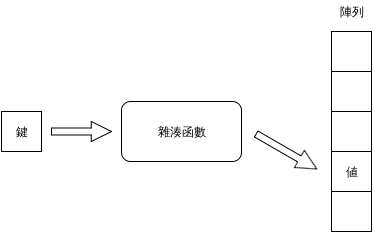

***********************
Map 和 Set
***********************

不論是陣列或是 vector，都是以數字做為其索引值，map 則可以用其他的資料型別做為索引值，進行\
快速查詢。Set 實作數學上集合 (set) 的概念，和 map 的概念有一些關連。

==============
Map
==============

Map 是以一對 ``鍵 (key) : 值 (value)`` 為單位的容器，透過特定的\ ``鍵``\ 可以找到\
相對應的\ ``值``\ 。以鍵找尋值的過程，透過\ **雜湊函數 (hash function)** 來轉換，\
如以下示意圖：

在資料結構的書籍中，這種容器稱為\ **雜湊表 (hash table)**\ ，在其他的程式語言中可能稱為\
雜湊 (hash)、字典 (dict)、關連性陣列 (associative array) 等。

-------------------------
使用 Map
-------------------------

Rust 內建語法不直接支援 map，而是透過標準函式庫進行物件呼叫。如下例：

.. code-block:: rust

   // Call HashMap class in Rust standard library
   use std::collections::HashMap;

   fn main() {
       // Create an empty map
       let mut hash = HashMap::new();  // HashMap<&str, &str>

       // Insert (key, value) pairs into the map
       hash.insert("one", "eins");
       hash.insert("two", "zwei");
       hash.insert("three", "drei");

       // Get value by key
       assert_eq!(hash.get("one"), Some(&"eins"));

       // Get None when (key, value) doesn't exist
       assert_eq!(hash.get("four"), None);
   }

Rust 的 map 透過鍵取值時，得到的是 ``Option<& value>`` 而非直接得到值，我們在先前有提過，\
這牽涉到 Rust 處理錯誤的方式，由於在 map 中取值時，有可能取到不存在的值，Rust \
以 Option 這個特殊容器包裝值，若可以得到值，就回傳一個包在 Option 內的值的參考，若無法\
得到值，則回傳 None。如果要得到值，可參考以下範例：

.. code-block:: rust

   use std::collections::HashMap;

   fn main() {
       let mut hash = HashMap::new();

       hash.insert("one", "eins");
       hash.insert("two", "zwei");
       hash.insert("three", "drei");

       let data = match hash.get("one") {
           None => "",
           Some(v) => *v
       };
       assert_eq!(data, "eins");
   }

要注意的是，在本例的 ``match`` 中，若 map 回傳空值，不能直接回傳 ``None`` 而要回傳空\
字串，這是因為 Rust 要求回傳的型別需一致。若很確定該鍵/值對的確存在，可參考以下方式：

.. code-block:: rust

   use std::collections::HashMap;

   fn main() {
       let mut hash = HashMap::new();

       hash.insert("one", "eins");
       hash.insert("two", "zwei");
       hash.insert("three", "drei");

       let data = *(hash.get("one").unwrap());
       assert_eq!(data, "eins");
   }

在本例中，我們直接將該 Option 容器解開取得參考後，再解參考得到值。

--------------------------
走訪 Map
--------------------------

若要走訪 map，可以依 map 的鍵來走訪，範例如下：

.. code-block:: rust

   use std::collections::HashMap;

   fn main() {
       let mut hash = HashMap::new();

       hash.insert("one", "eins");
       hash.insert("two", "zwei");
       hash.insert("three", "drei");

       // Iterate the hash by key
       for k in hash.keys() {
           println!("{} => {}", k, *hash.get(k).unwrap());
       }
   }

要注意的是，HashMap 不保證鍵的順序，讀者可試著多執行幾次本程式，即可發現此現象。典型的\
雜湊表不保證鍵的順序，除非某個函式庫有註明其雜湊表的實作有儲存鍵的順序，讀者應該視雜湊表的\
鍵為無序的。

或是依其鍵/值對來走訪，範例如下：

.. code-block:: rust

   use std::collections::HashMap;

   fn main() {
       let mut hash = HashMap::new();

       hash.insert("one", "eins");
       hash.insert("two", "zwei");
       hash.insert("three", "drei");

       // Iterate the hash by (key, value) pair
       for (k, v) in hash.iter() {
           println!("{} => {}", k, *v);
       }
   }

若有需要，也可依其值來走訪，範例如下：

.. code-block:: rust

   use std::collections::HashMap;

   fn main() {
       let mut hash = HashMap::new();

       hash.insert("one", "eins");
       hash.insert("two", "zwei");
       hash.insert("three", "drei");

       // Iterate the hash by value
       for v in hash.values() {
           println!("{}", *v);
       }
   }

要注意的是，雜湊表只能由鍵推得值，\ **無法**\ 倒過來由值推得鍵。雜湊表的鍵是唯一的，但值\
可以重覆，使用時必需要注意這個觀念。

==============
Set
==============

**集合 (set)** 是一個數學上的概念，表示一群不重覆的無序物件，對於集合的相關概念，可見\
**集合論 (set theory)** 的教材。由於集合的概念在程式設計中相當實用，有許多高階語言都\
實作集合這種容器。集合可以用雜湊表實作，以雜湊表來說，集合可視為值為空值的雜湊表。Rust 的 \
HashSet 內部的確是以 HashMap 來做為儲存資料的容器。

-----------------------------
使用 set
-----------------------------

這裡用一個簡單的範例展示如何使用 set：

.. code-block:: rust

   // Call HashSet from library
   use std::collections::HashSet;

   fn main() {
       // Create an empty set
       let mut set = HashSet::new();

       // Insert item into the set
       set.insert("C++");
       set.insert("Java");
       set.insert("Python");
       set.insert("Rust");
       set.insert("Go");

       // Check the property of the set
       assert_eq!(set.len(), 5);
       assert_eq!(set.contains("Rust"), true);
       assert_eq!(set.contains("Lisp"), false);

       // Remove item from the set
       set.remove("Python");

       // Check the property of the set
       assert_eq!(set.len(), 4);
       assert_eq!(set.contains("Rust"), true);
       assert_eq!(set.contains("Python"), false);
   }

雖然 HashSet 內部使用 HashMap，但簡化了介面，使用者不需要直接操作 HashMap。

---------------------------
Set 的二元操作
---------------------------

Set 可以實現一些集合的二元操作，像是\ **聯集 (unino)**\ 、\
**交集 (intersection)**\ 、\ **差集 (difference)** 等。以下用實例展示這些操作：

.. code-block:: rust

   // Call HashSet from library
   use std::collections::HashSet;

   fn main() {
       // Get two sets from two arrays
       let a: HashSet<_> = [1, 2, 3].iter().cloned().collect();
       let b: HashSet<_> = [4, 2, 3, 4].iter().cloned().collect();

       // Get the union of the two sets
       let union: HashSet<_> = a.union(&b).cloned().collect();
       assert_eq!(union, [1, 2, 3, 4].iter().cloned().collect());

       // Get the intersection of the two sets
       let intersection: HashSet<_> = a.intersection(&b).cloned().collect();
       assert_eq!(intersection, [2, 3].iter().cloned().collect());

       // Get the difference of a from b
       let diff: HashSet<_> = a.difference(&b).cloned().collect();
       assert_eq!(diff, [1].iter().cloned().collect());
   }

要注意的是，在這裡，我們傳入的是集合的參考而非集合本身，一方面是為了節省傳遞資料的時間，\
另一方面牽涉到 Rust 的所有權 (ownership)，我們將於後續章節中介紹這些概念。

=============================================
(案例選讀) 位數不重覆的數字
=============================================

在本節中，我們處理以下的問題：選出位數不重覆的數字。例如：``435`` 的三個數字都不重覆，\
就是一個符合條件的數字；而 ``919`` 則因為有重覆的 ``9`` 不符合本題目的條件。\
我們將某個數字拆開，每個位數各個放入集合中，若集合的長度大於等於數字的位數，則代表\
該數字的位數沒有重覆，符合我們的條件。

我們將這個程式的步驟以虛擬碼表示：

.. code-block:: text

   Let N a number with j digits
   Let S a set

   Let d(x) the digit of N at point x
   for i from 1 to j {
       Insert d(i) into S
   }

   Let len(x) the length of x
   if len(S) >= len(N) {
       N fits our criteria
   }

這裡提供程式碼範例，僅供參考：

.. code-block:: rust

   use std::io;
   use std::io::Write;
   use std::process;
   use std::collections::HashSet;

   fn main() {
       // Prompt for user input
       print!("Input a number: ");
       let _ = io::stdout().flush();

       // Receive user input
       let mut input = String::new();
       io::stdin()
           .read_line(&mut input)
           .expect("failed to read from stdin");

       // Parse the number
       let n = match input.trim().parse::<u32>() {
           Ok(i) => i,
           Err(_) => {
               println!("Invalid integer");

               // Exit the program with abnormal status code
               process::exit(1);
           }
       };

       let x: i32 = 10;
       for i in 1..(x.pow(n)) {
           /* Convert number to an iterator of char.
              Then, insert char to set. */
           let num_string = i.to_string();
           let mut chars = num_string.chars();
           let mut set = HashSet::new();
           let mut c = chars.next();
           while c != None {
               set.insert(c);
               c = chars.next();
           }

           // Get the digit number of i
           let mut digit = 0;
           let mut j = i;
           while j > 0 {
               j = j / 10;
               digit += 1;
           }

           // Check whether i fits our criteria
           if set.len() as i32 >= digit {
               // Show i in console
               print!("{} ", i);
           }
       }

       // Print tailing newline
       println!("");
   }
