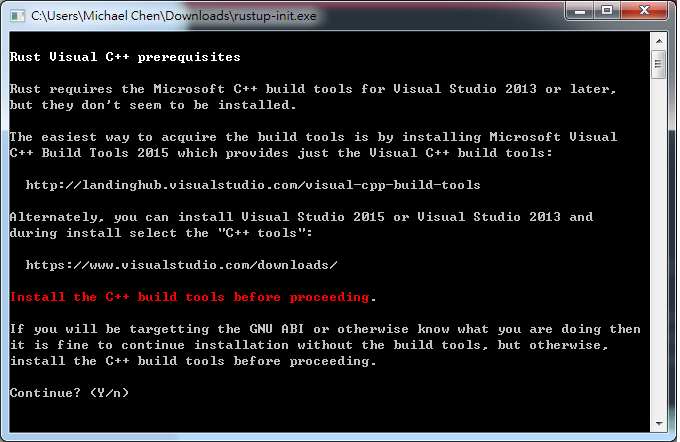

****************
準備工作
****************

本章介紹撰寫 Rust 程式前的準備工作。建議讀者在自己的電腦上實地動手建置 Rust 開發環境，\
以便後續練習撰寫 Rust 程式，這個過程不會花上太多時間。

=======================
試用 Rust
=======================

如果只是想先嘗試一下 Rust 的語法，可到 \
`Rust Playground <https://play.rust-lang.org/>`_ 網站，即可線上撰寫 Rust \
程式，不需額外安裝其他的軟體。由於安全性考量，這個網站不能使用外部套件，只能用 Rust 內建的套件，\
對於初期的練習這樣的環境已經足夠。

========================
安裝 Rust
========================

Rust 本身是跨平台的程式語言，同時支援 Windows、Mac、Linux、BSD 等多種平台，可透過 \
``rustup`` 這隻終端機程式來安裝及管理。\ ``rustup`` 的優點在於可以很輕鬆地在\
不同版本和平台的 Rust 編譯器間切換，對於更換不同 Rust 版本和\
**交叉編譯 (cross-compiling)** 相當方便。

-------------------
Windows
-------------------

根據 C/C++ 函式庫的來源不同，對應不同的 Rust 版本，一個是使用 Visual Studio 的 MSVC \
**ABI (Application Binary Interface)**\ ，一個是使用 GCC 編譯器的 GNU ABI，\
要使用那一個版本的 Rust，要看使用者想使用那個版本的 ABI 所建立的 C/C++ 函式庫而定。\
若讀者沒特別的偏好，建議以 GNU ABI 較佳，原因在於日後需要引用第三方 C/C++ 函式庫時，\
使用 GNU ABI 可以搭配 MinGW/MSYS2 所提供的第三方 C/C++ 函式庫。

在 Windows 下，到 Rust 官網下載 *rust-init.exe* 這隻小型程式即可安裝 ``rustup``\ 。\
啟動後會出現以下畫面：

按 y 後，繼續來到以下畫面：

預設是安裝 *x86_64-pc-windows-msvc* 版本的 Rust，但我們要使用 GNU ABI 的版本，故\
選 2，修改安裝版本。

參考下圖，修改為 *x86_64-pc-windows-gnu* 的 *stable* 版本：

之後，會自動下載 Rust 相關的程式，結束後關閉視窗即可。

日後若需要 MSVC ABI 版本的 Rust，也不需重裝，因 ``rustup`` 可在不同版本的 Rust 間切換。\
由於 Rust 的標準函式庫是跨平台的，筆者通常習慣在 Unix-like 系統下撰寫 Rust 專案，僅在需要時\
將該專案移到 Windows 系統下編譯，若沒有用到第三方 C/C++ 函式庫，通常都可以編譯成功，也\
不需要針對特定平台撰寫條件式編譯程式碼以呼叫特定平台的函式，可說是 Rust 的一項優點。

------------------------
Unix-like 系統
------------------------

對於 Mac 和 Linux 等 Unix-like 系統，``rustup`` 提供 shell 命令稿來安裝。在終端機\
輸入以下命令：

.. code-block:: console

   $ curl https://sh.rustup.rs -sSf | sh

``rustup`` 會出現提示文字，可視需求自行調整，若沒有特別需求，接受預設選項即可。\
``rustup`` 和 Rust 都會安裝到 *$HOME/.cargo/bin* 資料夾，再將此路徑加入 **PATH** \
變數即可。

===================================
使用 rustup 管理 Rust
===================================

透過 ``rustup`` 可管理多個版本的 Rust，相當方便，本節介紹 ``rustup`` 的使用方式。

---------------------
更新 Rust
---------------------

Rust 有三個不同的版本，分別為 stable、beta、nightly，有一些實驗性質的特性，僅放在 \
nightly 版本的 Rust。預設情形下，\ ``rustup`` 會安裝 stable 版本的 Rust。\
輸入 ``rustup update`` 即可更新 Rust。

.. code-block:: console

   $ rustup update
   info: syncing channel updates for 'stable'
   info: downloading component 'rustc'
   info: downloading component 'rust-std'
   info: downloading component 'rust-docs'
   info: downloading component 'cargo'
   info: installing component 'rustc'
   info: installing component 'rust-std'
   info: installing component 'rust-docs'
   info: installing component 'cargo'
   info: checking for self-updates
   info: downloading self-updates

     stable-x86_64-unknown-linux-gnu updated - rustc 1.14.0 (e8a012324 2016-12-16)

如果要更新 ``rustup``，輸入 ``rustup self update``\ 。

.. code-block:: console

   $ rustup self update
   info: checking for self-updates
   info: downloading self-updates

-----------------------------------
切換 toolchain
-----------------------------------

Rust 有許多針對不同 CPU、系統、C/C++ 函式庫的版本，透過 ``rustup`` 可快速地切換。先以 \
``rustup toolchain list`` 列出所有可選的版本：

.. code-block:: console

   $ rust target list
   # Omit some message
   x86_64-apple-darwin
   x86_64-apple-ios
   x86_64-pc-windows-gnu
   x86_64-pc-windows-msvc
   x86_64-rumprun-netbsd
   x86_64-unknown-freebsd
   x86_64-unknown-linux-gnu (default)
   x86_64-unknown-linux-musl
   x86_64-unknown-netbsd

`musl <https://www.musl-libc.org/>`_ 是一套小型的 C 函式庫，可用來在 Linux 下建立\
靜態連結的機械碼。若想安裝以 musl 為基礎的 Rust，使用 ``rust target add``\ ：

.. code-block:: console

   $ rustup target add x86_64-unknown-linux-musl

日後在編譯專案時，可指定特定的 target：

.. code-block:: console

   $ cargo build --target=x86_64-unknown-linux-musl

-----------------------------------
使用實驗性質的特性
-----------------------------------

某些尚在實驗性質、不穩定的特性，會在 nightly 版本的 Rust 發布。若想使用 nightly 版本的 \
Rust，輸入 ``rustup install nightly``\ 。

.. code-block:: console

   $ rustup install nightly
   info: syncing channel updates for 'nightly'
   info: downloading toolchain manifest
   info: downloading component 'rustc'
   info: downloading component 'rust-std'
   info: downloading component 'rust-docs'
   info: downloading component 'cargo'
   info: installing component 'rustc'
   info: installing component 'rust-std'
   info: installing component 'rust-docs'
   info: installing component 'cargo'

     nightly-x86_64-unknown-linux-gnu installed - rustc 1.15.0-nightly (71c06a56a 2016-12-18)

安裝完後，可輸入 ``rustup default`` 切換 Rust 版本。

.. code-block:: console

   # Use nightly version
   $ rustup default nightly

   # Use stable version
   $ rustup default stable

在實務上，較不建議使用 nightly 版本的 Rust，會造成專案程式碼的不穩定。

----------------------------
交叉編譯
----------------------------

由於 Rust 的函式庫是跨平台的，理論上，交叉編譯也是可行的。假若想要在 Linux 上交叉編譯\
某個 Rust 專案到 Mac 平台，在該專案的根目錄輸入以下指令：

.. code-block:: console

   # Say that we are on Linux now
   $ cargo build --target=x86_64-apple-darwin

*註：經筆者實際測試，交叉編譯有時仍有問題需自行排除，和該平台的 C/C++ toolchain 有關。*

若該 Rust 專案只用到 Rust 程式碼，應該都可以在不同系統間編譯。若有用到第三方 C/C++ \
函式庫，則需自行建置交叉編譯的環境。可參考 `crosstool-NG <http://crosstool-ng.org/>`_ \
或其他的方案來建立環境，但交叉編譯是較進階的主題，本書不詳述，請讀者自行查閱相關資料。

-------------------------------
反安裝 Rust
-------------------------------

如果因某些因素，決定不想用 Rust 了，可以用以下指令反安裝 Rust 和 ``rustup``：

.. code-block:: console

   $ rustup self uninstall

============================
安裝開發工具
============================

目前支援 Rust 的整合式開發環境 (IDE, Integrated Development Environment) 如下：

- Eclipse
- Visual Studio
- IntelliJ IDEA

目前支援 Rust 的編輯器 (editor) 如下：

- Emacs
- Vim
- Sublime Text
- Atom
- Visual Studio Code

對於練習用的程式碼或小型專案，使用編輯器較為輕巧方便，對於中大型專案，IDE 則支援較多的功能。\
筆者在圖形介面下使用 Atom，在終端機下使用 Emacs，而讀者可自行從中選用喜歡的開發工具，這裡就\
不列出每個工具的安裝和使用方法。

*註：Emacs 及 Vim 上手較為困難，程式設計初學者宜先嘗試其他開發工具。*

===========================
Hello World
===========================

接下來，我們用 Hello World 這佪經典的範例，練習如何撰寫 Rust 程式。

首先，用編輯器建立一個檔案 *hello.rs*，加入以下的內容：

.. code-block:: rust

   fn main() {
       println!("Hello, World");
   }

接著，用 Rust 編譯器 ``rustc`` 編譯這個程式，然後執行：

.. code-block:: console

   $ rustc hello.rs
   $ ./hello
   Hello, World

如果成功顯示出 Hello, World 字串，代表我們已經成功撰寫第一個 Rust 程式。

=========================
Cargo
=========================

雖然我們成功編譯出第一個 Rust 程式，隨著專案的規模上升，外部相依性增加，\
編譯指令會更複雜。為了簡化編譯軟體的步驟，Rust 提供 Cargo 這個專案管理程式。\
透過 Cargo，可以簡化 Rust 專案編譯、測試和發佈等步驟。

我們現在用 Cargo 重新撰寫 Hello World 程式。Cargo 專案分為兩種，一種是主程式，\
一種是函式庫，前者是可直接執行的執行檔，後者則是供其他的外部程式呼叫。我們的 \
Hello World 程式屬於主程式。輸入以下指令：

.. code-block:: console

   $ cargo new --bin hello
   $ cd hello

編輯 *src/main.rs* 檔案，改為前述的 Hello World 程式碼。接著，執行該程式：

.. code-block:: console

   $ cargo run
    Compiling hello v0.1.0 (file:///home/cwchen/src/rust_ex/hello)
     Finished debug [unoptimized + debuginfo] target(s) in 0.13 secs
      Running `target/debug/hello`
   Hello, world!

若顯示出 Hello World 字串，代表專案執行成功。

若要編譯程式，用 ``cargo build`` 指令即可。預設情形下，生成的是帶有除錯誤息且未優化的機械碼，\
若要生成對外發布的程式碼，則用 ``cargo build --release`` 指令即可。強烈建議日後在撰寫 \
Rust 程式碼時，將程式碼以 Cargo 管理。本書假定讀者使用 Cargo 管理程式碼，不會特別寫出編譯\
程式碼的指令。
